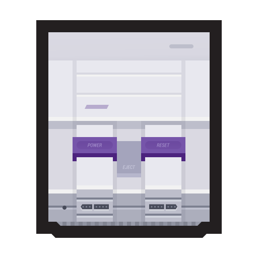

# SNES 👾

<p align="center"></p>
<p align="center">&laquo;<b>A Fullstack project to render SNES box cover arts.</b>&raquo;</p>
<p align="center">SNES is a very simple Fullstack project, including a Backend for Frontend API and a React application that lists SNES box cover arts</p>
<br />
<br />

## Description

SNES was created for study purposes - The objective is using it as a simple project example to use in a mentorship I'm having in my current workplace.

## Project
SNES has just X endpoints to receive data.

**GET** - `/TBD/:TBD` <br/>

### Installing

To run the project on development mode, you just need an LTS Node version installed (vX or higher recommended), and Yarn for managing the packages. If you haven't it yet, you can follow the [Yarn installation guide](https://classic.yarnpkg.com/pt-BR/docs/install/), on their official page.

With Node and Yarn installed, run the commands below. They will clone the project on the current folder, download all the project dependencies and, in a few minutes, the project can be accessed by Insomnia, Postman, cURL or on any program that uses HTTP requests communication. Please do it on port `:XXX`.

```shell
git clone https://github.com/bolognini/snes.git
cd snes
yarn && XXX
```

### Built With

* [XXX](xxx) - XXX
